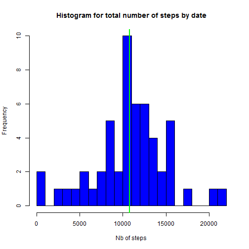
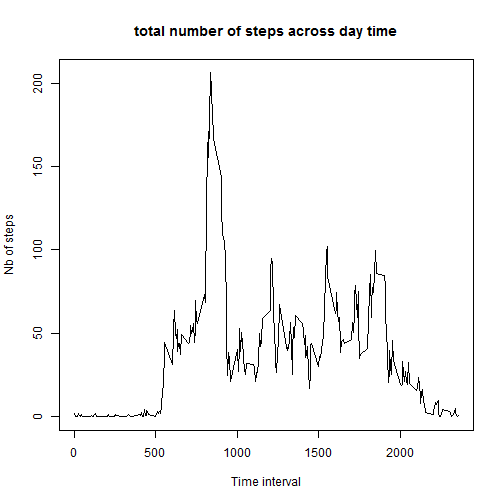
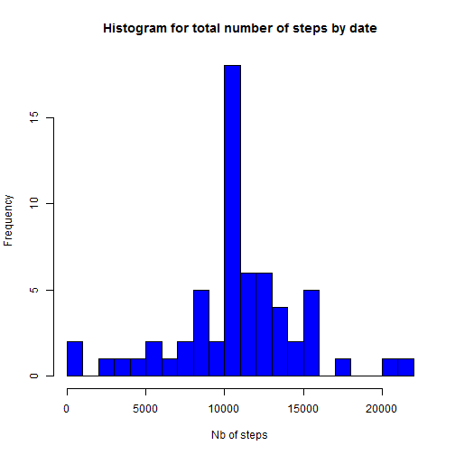
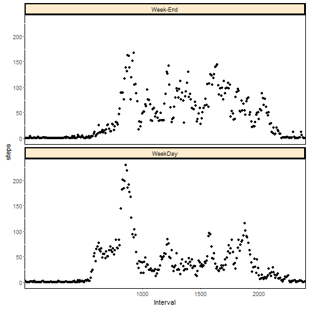

The goal of this project is to provide detailed analysis of a data set. This dataset provides measures on physical activity during 2 months. The measures are taken every five minutes. 

In this project, we will give different analyses of the dataset. 

## Loading and preprocessing the data. 

The dataset is loaded an the columns are renamed to give more appropriate names


```r
activityDF <- read.csv("activity.csv",header=TRUE,sep=",",stringsAsFactors = FALSE)
names(activityDF) <- c("steps","ActivityDate","TimeInterval")
```


```r
library(dplyr)
library(lubridate)
```

After the data load, we will transform them a little bit, in particular to transform the dates, stored as characters, to date format.
A quick analysis of data lets us show NA values. SO, in a first time, we will get rid of them.


```r
tbl_activityDF <-tbl_df(activityDF)
tbl_activityDF <- tbl_activityDF %>% mutate(ActivityDate = ymd(ActivityDate), TimeInterval=sprintf("%04d",TimeInterval))
tbl_activityDF_Clean <- filter(tbl_activityDF,complete.cases(tbl_activityDF))
```

## What is mean total number of steps taken per day?

Here we want to compute the mean number of steps by day. We do that in two steps :

 * we group the data by activity date
 * we aggregate the data and compute the sum of steps by day


```r
#dev.new()
#png('hist_TotalStepsPerDay.png')
TotalStepsPerDay <- aggregate(list(NbSteps = tbl_activityDF_Clean$steps), by = list(ActivityDate=tbl_activityDF_Clean$ActivityDate),FUN = sum)
hist(TotalStepsPerDay$NbSteps,breaks=seq(0,22000,1000),col="blue",main="Histogram for total number of steps by date", xlab="Nb of steps")
print(summary(TotalStepsPerDay))
```

```
##   ActivityDate           NbSteps     
##  Min.   :2012-10-02   Min.   :   41  
##  1st Qu.:2012-10-16   1st Qu.: 8841  
##  Median :2012-10-29   Median :10765  
##  Mean   :2012-10-30   Mean   :10766  
##  3rd Qu.:2012-11-16   3rd Qu.:13294  
##  Max.   :2012-11-29   Max.   :21194
```

```r
abline(v=mean(TotalStepsPerDay$NbSteps), col="red", lwd=2) #vertical line for mean value
abline(v=median(TotalStepsPerDay$NbSteps), col="green", lwd=2) #vertical line for median value
```



```r
# dev.off()
```

We drew two vertical lines : a red one for the average value of the total number of steps by day, and a green one for the median value of the total number of steps by day. 
What we notice is that the two lines are superimposed. That means that the two values are very close on from the other. Let's take a look an the summary of the dataset :


```r
summary(TotalStepsPerDay)
```

```
##   ActivityDate           NbSteps     
##  Min.   :2012-10-02   Min.   :   41  
##  1st Qu.:2012-10-16   1st Qu.: 8841  
##  Median :2012-10-29   Median :10765  
##  Mean   :2012-10-30   Mean   :10766  
##  3rd Qu.:2012-11-16   3rd Qu.:13294  
##  Max.   :2012-11-29   Max.   :21194
```
The **median** is <span style="color:blue">**10765**</span> whereas the **mean** is  <span style="color:blue">**10766**</span>. The difference is only 0,01%. 

## What is the average daily activity pattern?
Here we want to compute the average value of the number of steps over all the activity days. This can be done by the code below :


```r
#dev.new()
#png('plot_meanStepsPerPeriod.png')
AvgStepsPerTimePeriod <- aggregate(list(NbSteps = tbl_activityDF_Clean$steps), by = list(TimeInterval=tbl_activityDF_Clean$TimeInterval),FUN = mean)
AvgStepsPerTimePeriod <- aggregate(list(NbSteps = tbl_activityDF_Clean$steps), by = list(TimeInterval=tbl_activityDF_Clean$TimeInterval),FUN = mean)
with(AvgStepsPerTimePeriod,plot(NbSteps ~TimeInterval, xlab="Time interval", ylab="Nb of steps", type="l", main="total number of steps across day time"))
```



```r
#dev.off()
```

To check the 5-minutes period having the greatest value of average number of steps, we can sort the data frame by decreasing NbSteps and dispaly the first values


```r
# Sort the data by Nb of average steps decreasing
AvgStepsSorted <- arrange(AvgStepsPerTimePeriod, desc(NbSteps))
# Print the top 6 of the sorted dataframe
print(head(AvgStepsSorted))
```

```
##   TimeInterval  NbSteps
## 1         0835 206.1698
## 2         0840 195.9245
## 3         0850 183.3962
## 4         0845 179.5660
## 5         0830 177.3019
## 6         0820 171.1509
```

The searched value is **0835**, i.e. the time period **between 08:35 and 08:40**.

## Imputing missing values

In this section, we will have a look on the missing values and their influence on the global data frame. The lines having NA values can be retrieved in the tbl_activityDF_Missing below :


```r
tbl_activityDF_Missing <- filter(tbl_activityDF,!complete.cases(tbl_activityDF))
NbMissingValues = dim(tbl_activityDF_Missing)[1] 
print(NbMissingValues)
```

```
## [1] 2304
```

We then have <span style="color:blue">**2304**</span> rows with NA values. To check how these values are spread over the activity days, we can use the following :


```r
table(tbl_activityDF_Missing$ActivityDate)
```

```
## 
## 2012-10-01 2012-10-08 2012-11-01 2012-11-04 2012-11-09 2012-11-10 
##        288        288        288        288        288        288 
## 2012-11-14 2012-11-30 
##        288        288
```

There are 8 dates with the same number of records, i.e. 288. It is precisely the number of 5-minutes intervals in a day. This means that there are no activity dates having both NA and non-NA values. 

The strategy we will adopt to replace the non-NA values is to compute the mean value for each 5-minutes period over all the activity dates. As a consequence, we will use the data frame AvgStepsPerTimePeriod above.
To do that, we will use the data frame ***AvgStepsPerTimePeriod*** defined above, and join it with the original data frame tbl_activityDF. Then we will replace, in the original column *steps*, the NA values with mean value of steps given in the  data frame ***AvgStepsPerTimePeriod***. 


```r
MergeDF <- inner_join(AvgStepsPerTimePeriod,tbl_activityDF, by= c("TimeInterval"))
MergeDF <- MergeDF %>% mutate(steps = ifelse(is.na(steps), NbSteps,steps))
```

Then we compute the sum of the new *steps* column by activity date, as we did at the beginning of this project. 


```r
TotalStepsPerDayNew <- aggregate(list(stepsUpdated = MergeDF$steps), by = list(ActivityDate=MergeDF$ActivityDate),FUN = sum)
#dev.new()
hist(TotalStepsPerDayNew$stepsUpdated,breaks=seq(0,22000,1000),col="blue",main="Histogram for total number of steps by date", xlab="Nb of steps")
```



```r
print(summary(TotalStepsPerDayNew)) # the values of mean and median are equal 
```

```
##   ActivityDate         stepsUpdated  
##  Min.   :2012-10-01   Min.   :   41  
##  1st Qu.:2012-10-16   1st Qu.: 9819  
##  Median :2012-10-31   Median :10766  
##  Mean   :2012-10-31   Mean   :10766  
##  3rd Qu.:2012-11-15   3rd Qu.:12811  
##  Max.   :2012-11-30   Max.   :21194
```

As shown in the summary of the dataframe ***TotalStepsPerDayNew***, the mean and median values are now identical. This means that our transformation smoothed the values. 

## Are there differences in activity patterns between weekdays and weekends?

We now want to know if there is any difference in the activity between week days and weekends. We need to add a new variable giving this information.


```r
MergeDF_WDay <- MergeDF %>% mutate(WDay_WE = as.factor(ifelse(wday(ActivityDate) %in% c(1,7),"Week-End","WeekDay")))
```

Now we will draw the graphs giving the mean number of steps by day, for the week days and the week-ends.
The x-axis gives the 5-minutes period, and the y-axis the mean number of steps


```r
MergeDF_WDay <- MergeDF %>% mutate(WDay_WE = as.factor(ifelse(wday(ActivityDate) %in% c(1,7),"Week-End","WeekDay")))
MergeDF_WDay_Mean <- aggregate(list(steps = MergeDF_WDay$steps), by = list(WDay_WE =MergeDF_WDay$WDay_WE,TimeInterval=MergeDF_WDay$TimeInterval),FUN = mean)
```


```r
library(ggplot2)
g1 <- ggplot(MergeDF_WDay_Mean, aes(x=TimeInterval,y=steps))
g1 <- g1 + geom_point() + facet_grid(.~WDay_WE) + theme(strip.background = element_rect(colour="black", fill="BlanchedAlmond", size=1.5, linetype="solid"),
												   panel.background= element_rect(fill="white", linetype="solid",colour="black")) 
g1 <- g1 + facet_wrap(~WDay_WE,nrow = 2) + scale_x_discrete(name="Interval", breaks = c(0,500,1000,1500,2000,2500),labels = c(0,500,1000,1500,2000,2500))
print(g1)
```


